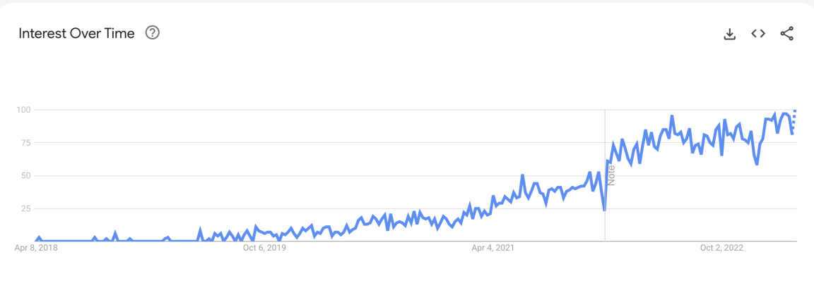

大家好，我是 Taylor，MLOps 系列文章围绕着机器学习中 MLOps 详细介绍了其概念，源头，解决的问题以及目前业界的发展情况。 本篇文章是系列文章里面的第一篇，对 <mark>MLOps 的概念，出现的背景</mark>进行了详细的介绍。

本文包含如下几个部分：

* MLOps 的定义 - MLOps是什么？

* 机器学习建模全生命周期介绍 - Machine Learning 流程是什么样的？

* MLOps 的价值 - MLOps 解决了什么问题？

# MLOps 的定义 - MLOps是什么？

MLOps 还是一个相对来说比较新的概念。从 [Google 搜索指数](https://trends.google.com/trends/explore?date=today%205-y&q=mlops&hl=en)来看，2021 年后对于 MLOps 的关注度才有一个明显的上升，并一直在持续上涨。

根据[维基百科](https://en.wikipedia.org/wiki/MLOps)和 [databricks](https://www.databricks.com/glossary/mlops) 的定义，<mark>MLOps （Machine Learning Operations）是一套基于实践的方法和工具，通过结合 DevOps、数据工程和机器学习等原则，执行持续集成与持续部署（CI/CD）的流程并对机器学习模型及相关数据进行恰当的监控、验证和管理，使数据科学家和机器学习工程师能够进行紧密合作，从而加速模型的开发部署过程并提升模型的质量。</mark>

从定义中我们可以看到，MLOps 代指的是对机器学习模型生产全生命周期的方法论和工具的总和，其特点可以总结为以下几点：

1. 自动化机器学习流程

2. 增强团队间的合作

3. 管理模型资产

4. 治理和保障模型安全

5. 确保生产流程的可复用可扩展

6. 全流程的版本管理

7. 保证数据、模型、工程质量

想要充分理解并应用 MLOps，首先要对机器学习建模流程有一个清晰完整的了解。

# 机器学习建模全生命周期介绍 - MachineLearning 流程是什么样的？

[机器学习](https://en.wikipedia.org/wiki/Machine_learning)诞生于严谨的数学体系。我们所熟悉的数学一般是求解一个公式的答案，或者给定几个变量和值，列出这几个变量之间的函数关系。但当数学理论投射到现实当中后，往往一个简单的问题就会变得异常复杂，我们所熟悉的简单的场景往往会受各种各样的因素影响，一个简单的公式无法准确描述它，此时若要进行建模和求解就会变得异常困难。

> 例如，如果我们想知道某间房子的市场估价，我们往往会参考多种因素：户型，房龄，装修，地段，学区，同类房子历史成交价，市场环境，房地产市场走向，卖家偏好，中介抽成，政策补贴，等等。

而此时丰富的算法和强大的算力让我们可以<mark>用机器的计算能力利用已有的数据来估算出海量参数之间的数学关系</mark>，进而让所得到的变量之间的关系函数尽量逼近于真实世界这些影响因素之间的关系。而得到这个关系之后，我们就可以提取新的数据来进行推理，预测出同一个场景下新的结果的可能的值。

> 例如，我们现在有一个城市里过去 3 年所有楼房的交易数据，以及所有房产交易发生时所涉及的影响因素的详细记录，如房屋状况，小区状况，交通便利度，交易人的收入，银行贷款利率，房地产成交金额走势，等等。我们对这些数据进行清理加工后，构建程序进行对场景进行建模，并利用机器进行参数求解，计算出这个模型中所有影响因素与结果之间的函数关系。之后我们可以收集想要新购房人的信息，以及所要购买的房屋信息，进行模型预测，即可得出房价的预估范围。

上面例子中介绍的流程就是一般意义上机器学习建模的普遍流程。

## 机器学习一般流程总览

如上图所描绘的，ML 的整个流程可以分为三个大步骤：<mark>1.分析与理解业务场景及业务数据，2.选择和构建机器学习数据及模型，3.部署及维护机器学习模型服务</mark>。 三个步骤相辅相成，将<mark>业务，数据，模型，功能</mark>整合在一起，运用机器学习解决实际的业务问题，为业务带来价值。

## 分析与理解业务场景及数据

实际生活中业务流程复杂多变，决定开始运用机器学习来解决业务之前会明确一些问题。

### 业务目标及问题是可度量的

机器学习建模在本质上是一个数学问题，而其结果往往也是用数学或者数学符号来表示。若要用机器学习来解决问题，则这个问题的结果一定是可以被数学来描述的，并且可以用计算机语言表达和运算得出的。

> 例如，房价是一个固定的数字或者数字范围，而这个范围是受一些常见的因素影响的，而这些影响因素是枚举穷尽的，且只有正相关或者负相关两种影响方向。所以通过收集常见的影响因素如，房屋面积，房龄，距离地铁站的距离等，就可以做出对房价的预测。

实际业务当中很多问题是无法用语言表达的，或者无法通过合理的理论来解释，则这种问题就不能被机器学习所解决。

> 例如，股价的走势，流行文化的趋势，情绪的起伏等。这些要么是有一定规律但太过复杂无法用有限的影响因素来度量的，要么是没有规律无法用数学模型来描述的。

### 问题是相对重复且符合某种规律的

机器学习的一个核心优势是它能在大量重复的数据中学习到隐藏的规律和模式。因此，如果一个问题具有一定的规律性，且场景在一定程度上具有重复性，那么机器学习就有可能很好的解决这个问题。

> 例如，在客户服务场景中，客服人员需要回答大量重复性的问题。这些问题往往遵循一定的模式，通过训练机器学习模型，可以使其学会自动回答这些常见问题，从而提高客户服务的效率。

然而，如果业务遇到的问题是随机的、无规律可循或者需要高度创新性的解决方案，那么机器学习可能就不是一个合适的选择。

> 例如，设计一款全新的产品或者开发一个面向未来的市场策略，这些问题往往需要创新性思维和对市场的深刻理解，而非机器学习所擅长的场景。

### 数据是充足的且是合法可收集的

机器学习模型的训练和预测能力很大程度上取决于数据的质量和数量。如果要解决的问题具备大量的、高质量的数据，那么机器学习模型就有更大的概率表现地更好。而对于数据的获取和保存，需要遵循现有的规章制度并持续保证数据的安全合规。

> 例如，在医疗领域，通过对大量病例数据的分析，机器学习模型可以帮助医生更快地诊断疾病。然而，在收集这些数据时，需要遵守相关法律法规，如数据隐私保护、患者同意等，以确保数据的合法性。

如果数据量不足或者数据质量低下，那么机器学习模型可能难以达到预期的效果。而未经法律允许就采集数据进行模型训练，则会面临法律风险。同时合法的数据所训练出来的模型需要符合一定的合规要求才能够上线投产，否则会有法律和道德上的损失。

> 例如，在金融领域，民营企业如果没有法律许可是不可能拿到用户的和银行的交易数据的，所以对于民营企业来说，训练相关的机器学习模型首先要解决的不是技术问题。而银行自己在使用金融交易数据来进行模型训练的时候，不仅要保证数据的真实性和安全性，而且需要在法律监管体系下，在审查与备案之后才能够投产上线。

### 用机器学习解决问题是降本提效的

用机器代替人力，对传统方式进行改革的一个重要原因是他可以降低成本。不论是通过发明各种新工具来简化操作，还是通过使用机器成本代替人力成本来节省开支，经济效益是应用时必然会衡量的一个标准。

> 例如，在制造业中，产品质量检测通常需要大量的人力物力。通过采用机器学习模型，可以自动通过图像和各种传感器来识别生产线上的不合格产品，从而减少人工检测的成本和时间，提高整体生产效率。

有时候风险与收益不是显而易见的，虽然需要投入很大的研发成本，如果一旦成功则会带来长久的收益，从整体减小损失和风险。

> 例如，自动驾驶一直是一个研发投入巨大且难度很高的课题，而行驶过程中一旦自动驾驶失效则会造成非常严重的后果。但整体而言，自动驾驶成熟之后，能够显著降低车祸的发生频率和严重程度。相比于手动驾驶来说，成熟的自动驾驶技术可带来更小的损失。这样的机器学习课题带来的社会和经济价值会远远大于其投入的资源，所以一直有公司在持续投入研发。

当然，并非所有场景都适合引入机器学习。在评估是否采用机器学习时，需要考虑模型的开发、训练、部署和维护成本，以确保机器学习是真正高性价比的选择。

> 例如，在制造业中，产品质量检测需要大量的人力物力。而对于人工成本和材料低廉的地区，采购或者研发机器学习的成本会远远大于直接使用人力的成本。所以在很多地区的工厂中，自动化检测虽然是先进的代表，但不是大多数企业的选择。

在业务团队和技术团队商讨明确了业务场景和具体要解决的问题，并且验证了有可能获取到充足的数据以支持机器学习训练之后，即可进入到机器学习建模的下一阶段。

## 选择和构建机器学习数据及模型

“<mark>数字时代，数据是公司最有价值的资产之一</mark>”，将采集来的业务数据用于[深度分析](https://en.wikipedia.org/wiki/Data_analysis)和人工智能训练，得到专属于自己业务的机器学习模型，是每个试图用机器学习解决业务难题的公司必经的一步。一般来讲这一步是会由机器学习研发团队独立负责。下面我们通过每一步的简单介绍和一个完整的例子进一步理解这整个流程。

### 数据收集与清洗

“算法决定了机器学习的下限，但数据决定了机器学习的上限。”用于机器学习的数据可能来源于公司自己的采集，也有可能从第三方数据服务提供商直接购买。<mark>无论数据是何种来源，要想被真正使用起来，都要被存储起来并符合一定的规范和要求以供后续使用。对于数据的描述，数据内容的分类和整理，以及对错误数据的纠正和剔除</mark>都是这一步需要处理的问题。

> 例如，某家房屋租售平台想要制作模型估算上海市区的房价，需要收集的数据可能包括：市区所有房屋的基本信息，市区近 5 年来房屋成交的历史记录，交易房屋的面积，楼层，房龄，距离地铁距离，距离公交车站距离。其中部分房屋是经过平台成交的，则相关的数据平台是已经有的。而另外一部分关于房屋的详细信息，以及与交通枢纽的距离，就有可能委托第三方数据公司按照一定的格式提供。平台拿到这些数据后先会对数据进行检查并修正或剔除错误的数据，如修正错误的门牌号，房屋地址格式，邮编，将多条关于同一个房屋的记录按照最新的汇聚成一条。清洗过的数据数据分门别类后存入数据中心内。

### 特征提取与数据标注

[<mark>特征</mark>](https://en.wikipedia.org/wiki/Feature_%28machine_learning%29)<mark>（Feature）指的是用于描述数据对象的属性或变量。</mark>特征是从原始数据中提取的、具有代表性的信息，用于在模型中表示数据的某种特点。机器学习模型正是使用这些特征来推理进而做出预测。

> 例如，对于一个房屋来说，房屋的面积，房龄，朝向都是对于这个房子的描述，是一个房子的特征。而得到房子距离地铁站的距离，需要记录房子的地理位置和所有地铁站的位置，再计算得到最近地铁站的距离，这个过程就是特征计算与提取。

<mark>数据标注（Data Annotation 或 Data Labeling）是指为原始数据（通常是无标签数据）添加标签或元数据的过程。</mark>机器学习模型通过消费[标注过的数据](https://en.wikipedia.org/wiki/Labeled_data)，能够更快地学习到特征与数据之间的规律。

> 例如，有经验的销售人员，对于给定的一间房屋描述能够给给出一个定价范围，而这个范围就是销售人员给这组数据进行的标注值。而在领一个场景中，对于给定房屋的内部图片，人们可以将其分类为“精装修”，“普通装修”或者“无装修”，对于照片的分类也属于对于图片数据的标注。

### 基于业务问题进行数据建模

完成初步的数据准备后，模型开发工程师开始针对业务数据进行数据建模。针对海量数据，机器学习工程师会先将数据分为训练集与测试集，然后<mark>结合业务问题来验证各种算法算子的效果以期望建立数据与所解答问题之间的关系。</mark>一般这种关系是用多种算法算子的组合和许多模型开发实验来建立和验证出来的。

> 例如，模型开发工程师拿到了 1 万条上海某区近 3 年的房屋销售记录及房屋的信息。他们会先将这 1 万条数据按照 1：9 的比例分拆为测试集和训练集。然后再选取合适的房屋交易特征来作为算法的输入，结合类似于线性回归，随机森林等算子，得到许多可能的算法模型。

### 模型训练

[<mark>模型训练</mark>](https://en.wikipedia.org/wiki/Training,_validation,_and_test_data_sets)<mark>是运用机器计算得到具体模型参数的过程。</mark>模型通过分析训练数据，不断调整模型内的参数，以将使用的参数尽可能的逼近各个特征真实的逻辑关系。模型开发工程师会使用同一组训练数据来训练上一个环节中设计的多个不同的模型，运用测试集来验证这些模型的效果，以期待测试集中的结果能够被模型正确的产出。因为训练过程中参数是逐步调整的，所以往往随着训练的时间越长，模型的预测会越准确。当测试集中的全部结果或者大部分结果都能够被模型正确产出之后，我们就可以说模型已经训练完毕了。随后通过分析训练好的模型，在许多备选模型中选出效果最好的一个或几个模型来进入到下一个阶段。

### 模型评测与验收

<mark>模型评测是用验证集对模型的推理效果进行验证。</mark>验证集与测试集不同的是，测试集用于判断模型何时结束，而验证集是用更广泛的场景和条件来判断模型的推理效果，以模拟生产环境的场景，确保发布时能够产生预期内的效果。通过模型训练，模型开发工程师拿到了多个表现较好的备选模型。在使用验证集对模型进行验证之后，如果符合预期，则效果最好的模型会被验收并进入发布流程。而如果不符合预期，则会回到最开始的一步，重新对建模方式进行调整。

> 例如，采用最近一个月的房屋成交记录来进行验证，以查看模型的预测结果是否符合最新的房屋成交价格趋势。

## 部署及维护机器学习模型服务

在经过了复杂的模型训练和评测之后，一个模型就可以开始准备发布上线了。发布上线的过程一方面需要和已有系统耦合，<mark>在现有工作流程中加入模型推理的步骤来把推理的结果运用到业务逻辑当中</mark>，另一方面上线的模型需要经过严格的合规审查与记录，并配置合适的监控措施来确保模型是安全的。此时需要业务系统开发部门来负责模型和系统之间的集成与部署。

### 模型审查与安全

随着法律的进步和各个公司对模型资产的管理越来越严格，任何<mark>模型在发布上线之前都需要经过详细的记录和审核以确保符合规范</mark>。尤其是金融、保险、医药等高风险领域，监管机构会严格规定所使用的机器学习技术的场景范围，模型可解释性，模型的性能和数据的合法性。通过审查并且备案的模型才能够被应用到实际生产当中。

> 例如，金融场景中，一个用于判断是否应该给某个用户放贷的机器学习模型，在上线之前需要经过金融监管部门的备案和审核，其中审核内容包括但不限于：此模型做出的拒绝贷款的判断是否是基于可以理解的理由的，此模型是否会对某些特定的人群做出禁止贷款的偏见，此模型是否对类似的数据能够做出稳定的输出和结果，此模型是否安全可控，此模型在银行系统中明确的使用范围。

### 模型发布与上线

通过审查的模型会进入发布流程。模型的发布意味着模型可以消费全新的之前没有见过的数据来进行预测。而根据模型的不同，可以消费的数据内容、格式也是不同的。部署模型不止意味着将模型放入已有系统，而且需要开发新的业务逻辑将现有系统改造为可以兼容模型的能力，在需要使用模型的时候将模型可以消费的数据处理好并正确解读模型输出的结果，在不需要模型的时候使用另外的逻辑处理业务逻辑。在模型发生漂移和故障时可以感知并且及时更新或者下线模型逻辑。

> 例如，金融场景中，一个用户在请求贷款时会填写贷款申请清单，但若要审批贷款，还需要其他用户没有提交的额外信息，如用户的信用分数，用户名下已经有的贷款总额，用户的交易行为等，来判断此用户的还贷风险。所有其余的信息都是需要在使用模型之前从其余的系统另外获取的。

### 模型服务的维护和迭代

模型服务的维护和迭代是发布上线之后的关键环节。<mark>随着时间的推移和业务场景的变化，模型可能会出现故障，性能下降，甚至不再适用于当前的业务需求。</mark>因此，需要对模型进行持续的监控和优化，以确保其始终保持在较高的性能水平。而随着业务需求的变化和新数据的不断积累，可能需要对模型进行更新和迭代。这包括对模型的结构、算法、参数等进行优化，以提高模型的性能和适应性。在更新模型时，应确保新模型的性能至少与旧模型相当，并且可以平滑地替换旧模型，以免影响线上服务的稳定性。

> 例如，在金融场景中，若贷款风险评估模型的预测准确率突然下降，可能导致放贷风险增加，从而影响金融机构的盈利。这种情况下，一方面依靠可靠的监控来发现问题，以将风险降低至最小，另一方面需要立即对模型进行调整或重新训练。

# MLOps 的价值 - MLOps 解决了什么问题？

机器学习是一个复杂的系统性工程，它通过多个团队的共同协作，同时使用和产生多种资源来为业务问题提供智能且低成本的解决方案。在带来价值的同时，机器学习流程中的困难显而易见。<mark>MLOps 通过多种工具和方法，在许多方面提升了机器学习建模流程的效率，缩短了周期，提升了模型和工程质量。</mark>

自动化机器学习流程

自动化代表了一个工程系统的成熟程度，而机器学习系统作为一个极其复杂的工业系统，自动化是其必不可少的一环。MLOps 中通过标准化数据、模型、服务的流程，能够将如数据自动处理，模型自动训练与部署，服务自动扩容、回滚等功能落地至具体的机器学习系统中，节省大量的重复性劳动，避免人为疏忽导致的错误。

增进团队间的合作

一个标准的机器学习流程，必然涉及至少 3 个团队：数据团队，模型团队以及工程团队。无论是 3-5 人的小团队还是 50-100 人的大团队，对于如何沟通协调任务，对齐业务目标，以及如何保证数据、模型、代码这些资产的一致性，都是极富挑战的事情。MLOps 提供了诸多工具和方法来减少人员交流当中的成本，能更好的明确责任归属，并且通过各种变更记录来明确根源问题所在。

管理模型资产

模型作为整个机器学习流程最终的产物，是工作价值的呈现。而模型不仅包含了最终的模型文件，还包含着其生产前和投产后的一系列最佳实践，如训练模型所用的数据、特征，模型所包含的算法，参数列表，推理脚本，部署规则以及人员信息等。而模型的推理性能以及投产后的推理质量也需要作为模型的一部分来进行管理以便在发生漂移的时候及时进行感知和更新。

治理和保障模型安全

在机器学习系统中，模型的安全性至关重要。MLOps 可以确保从模型训练到部署的整个过程都符合安全规范。通过对数据的权限管理、模型的访问控制和隐私保护措施，能够有效的降低安全风险。同时，通过对模型进行定期审计和漏洞扫描，可以确保模型在生命周期内的安全合规。

确保生产流程的可复用可扩展

MLOps 通过对整个机器学习流程的标准化和自动化，有助于提高工程的复用性和扩展性。通过创建通用的模板和组件，可以在多个项目中方便复用，从而提高开发效率。同时，MLOps 提供了有弹性的基础设施和服务，可轻松扩展和升级系统，实现在异常情况下自动回滚。

全流程的版本管理

机器学习全生命周期中涉及到非常丰富的资源，包括数据，特征，模型，配置，代码，文档，存储方式以及上线计划。这些所有的数据资产都是可以变化的，而任何的变化都有可能影响模型的效果甚至引发问题。而 MLOps 提供了丰富的工具来对全流程中大部分资产进行版本管理，且能够追踪变化的内容。这样可以确保在问题出现时，快速定位问题根源，进行回滚和修复。此外，版本管理有助于团队成员之间的协作，能够避免冲突和误操作。

保证数据、模型、工程质量

机器学习模型的质量不仅依赖于模型的质量，更依赖于数据的质量和团队之间的配合。MLOps 通过提供自动化工具，最佳实践以及持续集成/持续部署（CI/CD）流程来确保可靠的数据质量、模型性能以及工程实践，减少人工错误。通过自动化的数据清洗、特征工程、模型验证和测试，可以确保项目的高质量输出。

# 小结

基于机器学习而诞生的 <mark>MLOps 服务于参与到整个建模流程的所有团队和角色</mark>。随着人工智能领域的从业人员越来越多，机器学习流程会越来越标准化，所使用的工具会越来越丰富，整个 MLOps 的理论和生态会越来越完善与成熟，从有效加速人工智能技术的迭代，提升业务智能化的性能与质量。

此篇文章为 MLOps 系列文章的第一篇，请期待后续更多关于 MLOps 相关的介绍。

## 关于作者

**张育鑫（Taylor Zhang）**

腾讯高级工程师，认证高级云架构工程师，认证高级云开发工程师

机器学习平台，MLOps，大数据，云原生，数据密集型分布式系统

Find Me:

taylorzyx@hotmail.com

[LinkedIn](https://www.linkedin.com/in/yxzh/) | [Blog](https://taylorzyx.hashnode.dev/) | [Github](https://github.com/taylorzhangyx)

## 参考资料

1. [MLOps Principles](https://ml-ops.org/content/mlops-principles)

2. [MLOps phase-zero](https://ml-ops.org/content/phase-zero)

3. [Designing Machine Learning Systems by Chip Huyen](https://www.oreilly.com/library/view/designing-machine-learning/9781098107956/)

4. [CRISP-ML(Q). The ML Lifecycle Process.](https://ml-ops.org/content/crisp-ml)

5. [Databricks - MLOps](https://www.databricks.com/glossary/mlops)
