大家好，我是 Taylor，MLOps 系列文章围绕着机器学习中 MLOps 详细介绍了其概念，源头，解决的问题以及目前业界的发展情况。本篇文章是系列文章里面的第二篇，从机器学习建模流程的痛点出发，介绍了机器学习全流程中具体的问题以及 MLOps 提供的解决方案和案例。 本文包含如下几个部分：

1. 机器学习工程全生命周期剖析
    
2. MLOps 系统工程
    
3. MLOps 的价值和应用
    

---

**张育鑫（Taylor Zhang）**

腾讯高级工程师，认证高级云架构工程师，认证高级云开发工程师

机器学习平台，MLOps，大数据，云原生，数据密集型分布式系统

taylorzyx@hotmail.com

[LinkedIn](https://www.linkedin.com/in/yxzh/) | [Blog](https://taylorzyx.hashnode.dev/) | [Github](https://github.com/taylorzhangyx)

---

# 机器学习工程全生命周期剖析

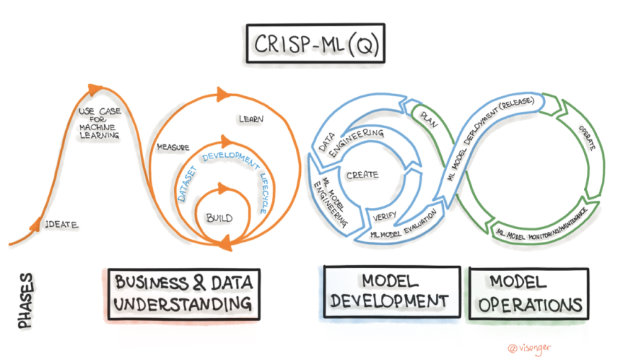

上一篇文章中（[【MLOps 系列 1】MLOps 起源 - When, What, and Why-机器学习建模全生命周期介绍](https://taylorzyx.hashnode.dev/mlops-origin-when-what-and-why)）我们介绍到，机器学习全流程简单来说可以分为三个部分：<mark>1.分析与理解业务场景及业务数据，2.选择和构建机器学习数据及模型，3.部署及维护机器学习模型服务</mark>。

而在实际生产当中，事情往往不是我们想象中的那么简单。如果我们把这张环状图拆开来细看，会得到如下更详细的图：

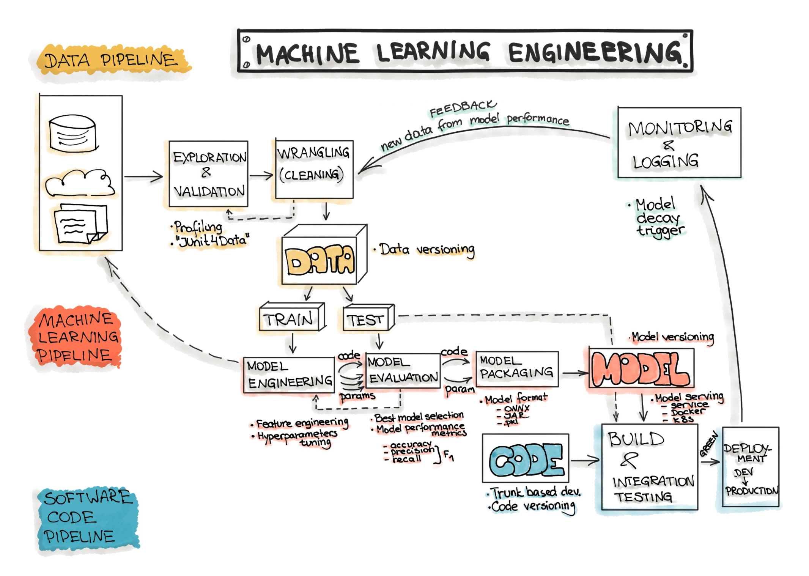

这个图中详细描绘了机器学习全流程当中工程实践部分的的详细阶段和步骤。

* <mark>数据</mark>工程工作流（Data Pipeline）
    
* ML <mark>模型</mark>工程工作流（Machine Learning Pipeline）
    
* <mark>软件</mark>工程工作流（Software Code Pipeline）
    

其中的每一步都蕴含着丰富的工作细节和各种挑战。

## 机器学习工程主流程剖析

* <mark>数据工程（Data Pipeline）</mark>
    

此阶段一般由数据团队负责，主要目的是为了按照标准采集，存储和管理海量数据，并对数据进行挖掘和标记以供建模使用。

在一开始的数据采集与存储，公司会按照业务需要去设计和建设数据基础设施以采集和存储相关数据。通常数据采集和存储包括数据源追溯与管理，存储空间预估，存储方式评估，数据获取，数据备份，隐私合规，元数据管理等步骤。在数据入库后，数据团队会对数据进行初步的数据探索与校验（Exploration & Validation）。此部分团队会按照数据管理规范，通过数据可视化和校验规则对数据质量进行验证，并记录数据的内涵和基本信息，缺失比例，分布情况，对数据进行标注打上标签。此时会重新审视业务需要的数据范围，如果发现所拥有的数据有缺失不足以完成建模则会回到上一步来收集更多数据。随后对经过校验的数据开始重构和清洗（Wrangling/Cleaning），此时会找出并修正不准确的数据，识别和移除错误值，填充缺失数据，移除与业务场景不相关的数据，并对数据进行重新排序。

此时得到的数据是相对完整且可靠的，可以直接应用到建模中。实际生产中此时还会对使用的数据进行数据版本（Data Versioning）的管理，对数据的内容进行版本记录，以便追踪数据的变化。

* <mark>模型工程（Machine Learning Pipeline）</mark>
    

模型工程阶段一般由算法团队负责，主要的目的是使用算法通过假设和实验来构建数据与业务需求之间的关系，训练出具有合适参数的模型并投入生产为业务创造价值。

数据在给到算法团队的时候会先被分为训练集(Train Set)、验证集和测试集(Test Set)。算法工程师会根据训练集来提取特征，进行特征工程（Feature Engineering），构建算法模型并训练模型，对超参进行调整。随后对实验出来的模型进行验证和评估，验证模型的准确性，召回率以及模型性能，以选择出最佳的模型结构和参数配置。模型在经过了验证之后，将对其代码，参数进行打包，按照一定的格式生成最终的模型文件。在生产过程中同一个模型根据输入的数据不同会经历不同的版本，团队会通过额外的模型版本控制对其加以区分，以确保能够在生产环境中准确使用。

* <mark>软件工程（Software Code Pipeline）</mark>
    

模型投产一般由软件工程团队主要负责，其中涉及到一系列软件工程的适配改造和模型推理阶段的应用。

模型生产出来之后的重要一步就是部署上线，在实际生产系统中产生价值。模型的应用分为离线推理和线上推理。无论何种模式，都涉及到推理框架的编写和使用，此步骤一般由机器学习工程师负责。模型的投产一般是将模型集成到现有的软件系统中，不论是从无到有将模型推理引入到系统中，还是随着模型的迭代和版本的更新，更改原有的代码逻辑，都会引入不同的数据格式，更新的使用流程等一系列改变，此时必不可少的会涉及到代码版本与模型版本框架的对应追踪。在模型编译打包并通过集成化测试（Build & Integration Test）之后，代码会通过如金丝雀部署或蓝绿部署的部署策略发布到线上。

此时整个模型的全部流程已经初步结束。在经历了一系列系统化的步骤之后，从`数据->模型->代码`的阶段，机器学习模型终于在业务生产中产生了价值。

## 模型迭代与更新

然而随着业务的不断发展和现实世界的不断变化，投产的模型会产生漂移（Model Drift）。[漂移的产生有可能来自于模型的缺陷本身泛化能力不足导致线上表现差，可能因为线上的样本和人群使用发生了改变](https://www.fiddler.ai/blog/drift-in-machine-learning-how-to-identify-issues-before-you-have-a-problem)，模型已经无法很好描述和预测人群的行为。而漂移的发现和原因分析都依靠完善的监控和日志系统来不断采集模型的结果并收集线上相关数据，持续反馈并沉淀到数据资产中。这些数据一方面构成新的数字资产，另一方面为模型的更新方向提供可靠依据。<mark>数据团队和算法团队依靠分析这些数据来重新训练模型，甚至构建新的模型。</mark>而若模型推理的性能不佳，工程团队会尝试优化现有推理框架和逻辑，甚至更换和开发新的框架来加快推理速度。

## 系统性的挑战

从刚才的介绍可以看到，机器学习是一个极度复杂又多变的系统性工程。其中涉及到多种资产和多个团队的紧密配合，而每个环节都面临着多种挑战。

人员组织管理

整个流程由多个团队共同负责，其中每个人员的职责边界，上下游之间的交接方式以及中间信息传递的准确程度都是很大的挑战。而流程中的责任归属又是实际执行中的另一大管理上的挑战。

人员组织管理

整个流程由多个团队共同负责，其中每个人员的职责边界，上下游之间的交接方式以及中间信息传递的准确程度都是很大的挑战。而流程中的责任归属又是实际执行中的另一大管理上的挑战。

重复劳动与资源复用

整个流程中涉及到大量的手动工作量和中间结果的产生，例如算法代码，特征提取，数据变换，实验模型。无论是产出的结果还是加工过程，都在很大程度上能够被复用。然而在现有执行的过程中，因为不同的业务场景由不同的团队负责，造成知识孤岛，即使相同的逻辑也会被重新实现，而导致重复劳动。

产品质量和检验标准

数据质量和模型质量是导致最终产品质量的直接因素。如果数据源不稳定，数据采集流程不规范不完整，采集到的数据波动大结构不合理，后续数据检验或者模型检验方法和实际的不匹配，则会对产出的结果造成挑战。

配套组件和代码管理

模型投产时不仅涉及到模型的上线，对模型相关的配套设施也需要同步更新。此时就会遇到到牵一发而动全身的问题，跟随新模型发布的有工程代码，接口协议，数据格式，数据版本，配置信息和机器信息。其中任何一环出错就会导致运行异常。而模型一旦出现异常和漏洞需要立即回滚的时候，其对整个系统的回滚要求就显得异常严格。

服务稳定性与可观测性

线上服务存在着流量无法预测的问题，而过高的瞬时流量会导致服务的高延时甚至宕机。模型服务因为其复杂的特性有可能存在各种逻辑依赖和文件依赖，在高峰流量到达时及时的扩容成为不小的挑战。而这种工程问题是一般机器学习工程师不善于解决的。

过程追踪与问题排查

一旦系统出现问题，工程师就需要排查与解决。因为机器学习的独特性，其问题的所在不仅可能出现在代码中，还有可能是因为数据质量，模型结构以及运行环境。此时如果丢失了模型与原始数据与加工过程的信息，过程中产生的失误和问题就无从排查。

安全合规

很多行业中，信息是敏感资产，不管是线下训练数据还是线上推理数据，需要通过使用各种访问权限加以控制。而模型作为数据加工后的结果，天然携带数据的属性，极有可能通过使用模型来反推出数据内容。而模型的上线又有各种规范的约束，如果加工过程中缺乏合规意识，合规流程不完善，会导致产生的模型结果无法通过验证，导致推倒重来，所有努力付之东流。

# MLOps 系统工程

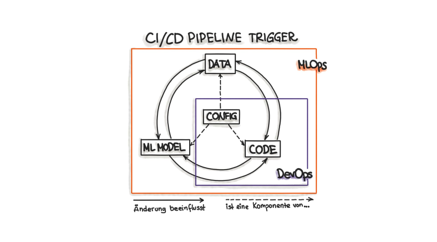

我们可以看出，机器学习工程全流程大致分为<mark>数据工程阶段</mark>，<mark>模型工程阶段</mark>和<mark>代码工程阶段</mark>。<mark>这几个阶段相互依赖，相互反馈，相互之间缺一不可，共同组成完整的流程来产生业务价值。</mark>

MLOps 的概念中，将整个系统拆解为 DataOps， ModelOps 和 DevOps 三个部分。实际生产过程中，人们在自己的领域内已经有很多技术和组织尝试，这些尝试极大的解决了现有的问题。

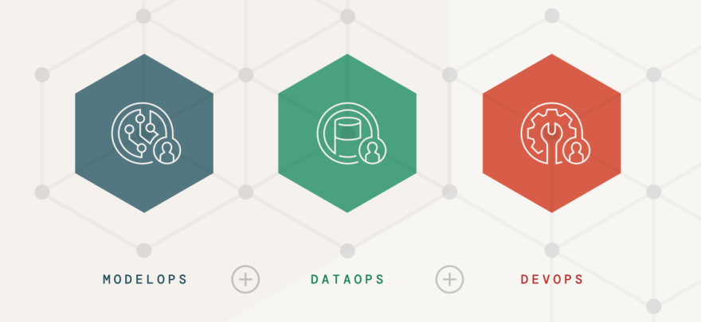

## DataOps

* 数据处理流水线（Data Pipeline）
    
* 数据版本管理（Data Versioning）
    
* [数据血统（Data Lineage）](https://www.techtarget.com/searchdatamanagement/tip/How-data-lineage-tools-boost-data-governance-policies)
    
* 特征库（Feature Store）
    
* 特征平台（Feature Platform）
    

### **数据血统**

<mark>数据血统关注数据的生命周期，包括数据在整个流程中是如何创建、处理、存储和使用的。</mark>它可以帮助组织识别数据质量问题，确保数据准确性和一致性，同时有助于满足合规要求。数据血统通过记录数据加工的全流程，

### **特征库**

<mark>特征库是一个存储与管理系统，用于保存特征的定义、计算逻辑和数值，</mark>以供数据科学家和工程师在机器学习项目中使用。特征库同时提供了一系列工具和接口，用于特征提取、转换、存储和查询。

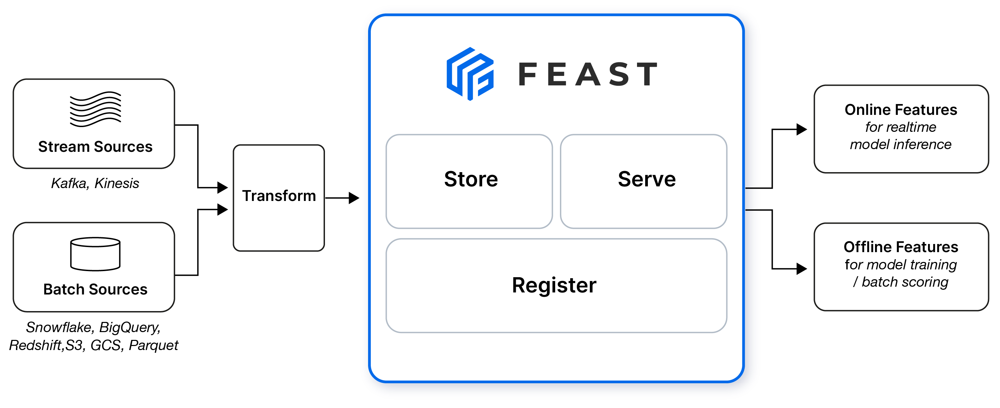

> [feast](https://feast.dev/) 作为市面上最火的[开源特征库](https://github.com/feast-dev/feast)，代表了特征库的典型功能范围和定义。它是前 google 工程师创立，维护者于 2020 年低加入 Tecton 团队，带领团队共同维护。 feast 解决了特征的存储，索引，与模型的关联关系，以及线上特征与线下特征的统一。

### **特征平台**

<mark>特征平台是一个集成的系统，用于支持机器学习项目中特征工程的全流程。</mark>它包括特征库、数据处理和转换工具、API和查询接口等组件。特征平台的目标是简化特征工程，提高机器学习项目的开发速度和质量。

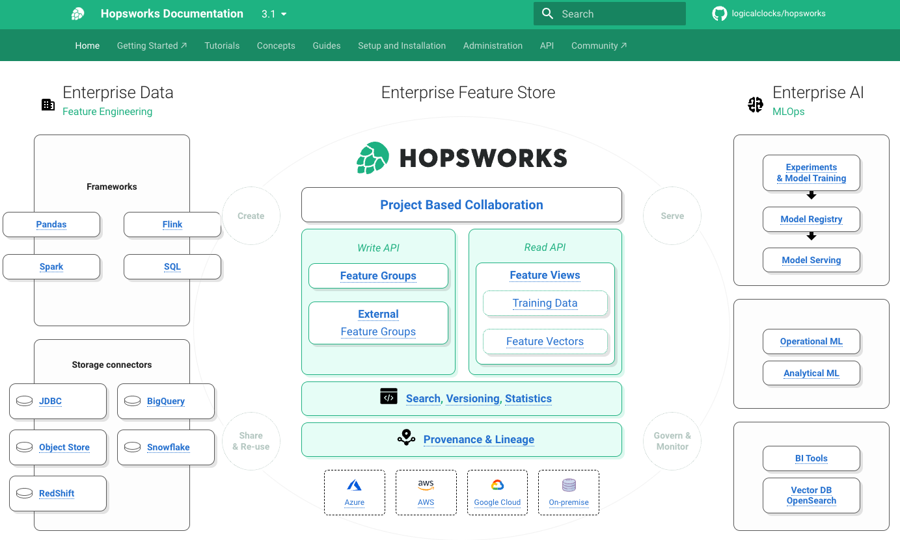

> [Hopsworks](https://github.com/logicalclocks/hopsworks) 是一个开源特征平台，由[瑞典的一家公司](https://www.hopsworks.ai/about-us)开发和维护。它的定位是一个以特征库为中心的机器学习平台，拥抱 MLOps 能力并提供标准化的解决方案。它提供云原生的部署方式，一键创建服务，按量收费。可以通过 Hopsworks 来管理特征，模型资产，开发和部署特征加工及训练流水线。Hopsworks 提供丰富的监控和管理能力来增加开发效率。 [little demo](https://c.app.hopsworks.ai/p/28823/view)

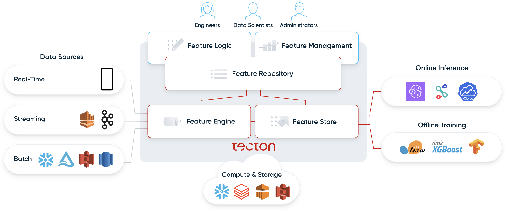

> [Tecton](https://www.tecton.ai/) 是[一家加州旧金山的创业公司](https://www.crunchbase.com/organization/tecton)，提供[企业化特征平台 SaaS 服务](https://docs.tecton.ai/docs/introduction/tecton-concepts)。它通过整合特征库，特征工程和数据加工流水线，为特征提供全生命周期的管理和开发解决方案，一站式实现了特征的提取，加工，复用，拼接，解决了线上推理实时计算和时效性等问题。

由于特征库与特征平台非常相似，而其定位和服务范围又很不相同，所以 Tecton 专门出了[一期节目](https://resources.tecton.ai/choosing-the-right-feature-store-feast-or-tecton)来讨论如何做出选择。

## ModelOps

* [自动学习（AutoML）](https://learn.microsoft.com/en-us/azure/machine-learning/concept-automated-ml?view=azureml-api-2)
    
* [模型治理（Model Governance）](https://ml-ops.org/content/model-governance)
    
    * [模型公平性（Model fairness and bias mitigation）](https://en.wikipedia.org/wiki/Fairness_(machine_learning))
        
    * [模型可重复性验证（Model Reproducibility）](https://neptune.ai/blog/how-to-solve-reproducibility-in-ml)
        
    * [模型可解释性（model interpretability）](https://docs.aws.amazon.com/whitepapers/latest/ml-best-practices-healthcare-life-sciences/model-interpretability.html)
        
    * [模型漂移检测（Model Drift Detection）](https://towardsdatascience.com/machine-learning-model-drift-9cc43ad530d6#:~:text=The%20most%20straightforward%20approach%20to,score%2C%20and%20ROC%2DAUC.)
        
* 模型推理框架（Model-serving systems）
    
* [多模型部署（Multi-model Deployment）](https://www.anyscale.com/blog/multi-model-composition-with-ray-serve-deployment-graphs)
    

## DevOps

* [A/B 实验（A/B Test）](https://mlops.community/the-what-why-and-how-of-a-b-testing-in-ml/)
    
* [CI/CD 流水线（Continuous Integration/Continuous Deployment Pipeline）](https://medium.com/@haythemtellili/machine-learning-ci-cd-pipeline-with-github-actions-and-amazon-sagemaker-f99818b7506a)
    
* [可观测性（Observability）](https://towardsdatascience.com/what-is-ml-observability-29e85e701688)
    
* 端到端测试（End-to-end Test）
    
* 服务容器化和云原生（Containerization and Cloud-Native）
    

### **A/B实验（A/B Testing）**

<mark>A/B 实验又称为拆分测试，是一种用于比较两个或多个变量之间效果差异的实验方法。</mark>在A/B实验中，用户群被随机分为两个或多个组，每组分别接触到不同的变量（如页面设计、功能、模型算法等），然后通过分析各组用户的行为数据，判断哪个变量更能实现预定的目标（如转化率、用户留存等）。

> [腾讯 AB 实验平台](https://abtest.qq.com/) 通过精细的流量控制，人群划分，数据收集和分析，实现低成本，高效率实验。实验平台通过流量层域的划分，实现实验与实验之间，实验不同版本之间共享流量的同时互不干扰。

# MLOps 的价值和应用

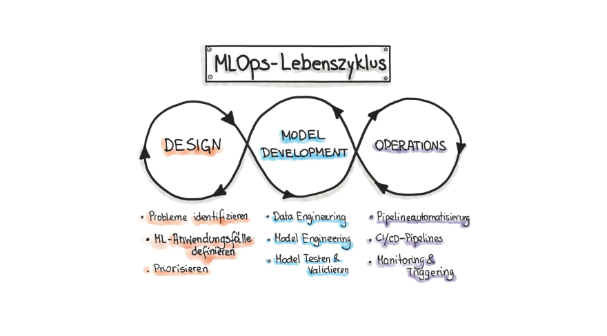

MLOps 有四个主要目标：<mark>1. 加速模型迭代，2. 提升模型质量，3. 确保模型安全合规，4. 增强团队协作。</mark>通过全面整合和追踪模型开发的设计、开发和部署运维环节，<mark>MLOps 将全流程串联起来，让数据和算法工程师更聚焦于自己的工作，不用担心合规和部署等问题。</mark>

## 全流程自动化

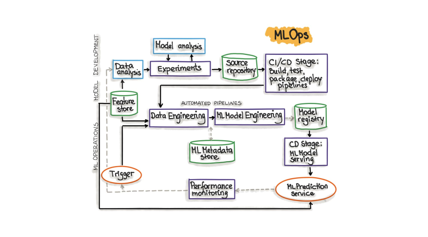

MLOps 所提供的最大价值就是全流程的自动化，将全流程有机的结合起来。在传统的机器学习建模当中，几乎所有的事情都是由人工手动去完成的，无论是模型的迭代更新，线上发布还是错误回滚，所有的这些都需要人力来参与。 <mark>MLOps 尝试将整个流程标准化、组件化、配置化，并且通过 CI/CD 自动化流水线把所有的流程串联起来</mark>，以实现自动的数据采集与预处理，自动特征提取，自动模型结构与算法选择，自动调参，自动模型训练，自动模型验证与评估，自动模型部署与回滚，模型性能与效果持续监控。

其中<mark>自动数据采集，自动重训练和自动部署</mark>是当前市场上 MLOps 最广泛应用的，也是最重要的能力体现。

在模型部署至生产环境后， 一开始模型的表现是符合预期的。 但随着时间的流逝，模型的效果有可能会发生漂移。 而此时就有必要用最新的数据对模型进行重新训练，以让模型能够更符合最新的线上场景。此时的模型重训练，往往不需要对模型的结构和算法进行调整，而只需要使用更新后的数据来对模型进行新一轮的 fine tune 即可。

MLOps 的自动化方案将此模型对应的数据采集、预处理、特征提取与特征工程的过程沉淀下来，将采集到的原始数据直接经过自动数据采集流水线加工成可以被模型直接使用的数据集。通过数据版本控制锁定最新的一批训练数据和验证数据。在触发器的控制下，在满足一定条件时，重训练流程会被自动触发。比如当线上模型的指标漂移程度达到一定的阈值时，自动重训练服务会寻找到数据中心中对应模型的最新训练集进行训练，并在训练好后自动使用最新的测试集和验证集进行测试和验证。如果通过验证则模型会被自动打包准备发布。自动化发布过程会控制模型服务进行灰度发布，并持续监控灰度发布过程中服务的推理速度，模型效果和请求成功率，一旦出现指标异常会触发自动回滚，将服务回退至原始版本，尽量将线上影响降到最低。

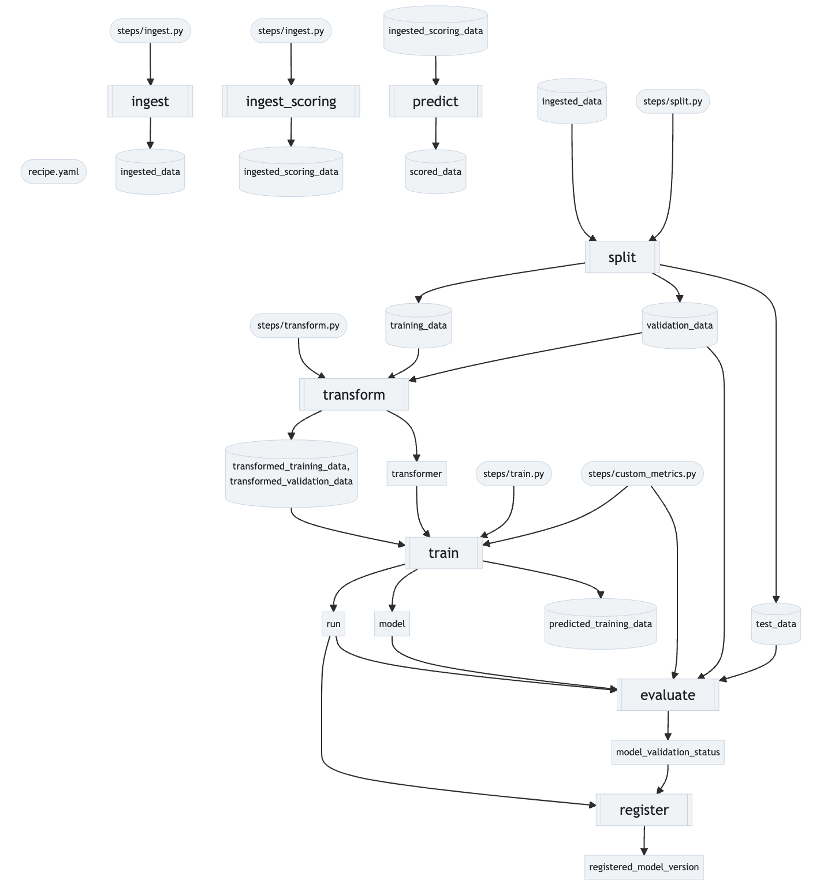

> **MLflow** 是 Databricks 发布的一款开源一站式机器学习训练平台，其中的 [MLflow Recipes](https://mlflow.org/docs/latest/recipes.html) 功能提供了较为完整的自动重训练能力。[例子](https://github.com/mlflow/recipes-regression-template/blob/main/README.md)中基于 MLflow 提供的模型观测（MLflow Tracking）， 模型封装（MLflow Models）， 模型仓库（MLflow Model Registry）等能力，通过集成化的模型配方（MLflow Recipes）将各个步骤有机的结合起来。通过可自定义的流水线模板和步骤，将自动化的 MLOps 全流程串联起来，实现了自动化的重训练和部署。

## 团队协同与过程管理

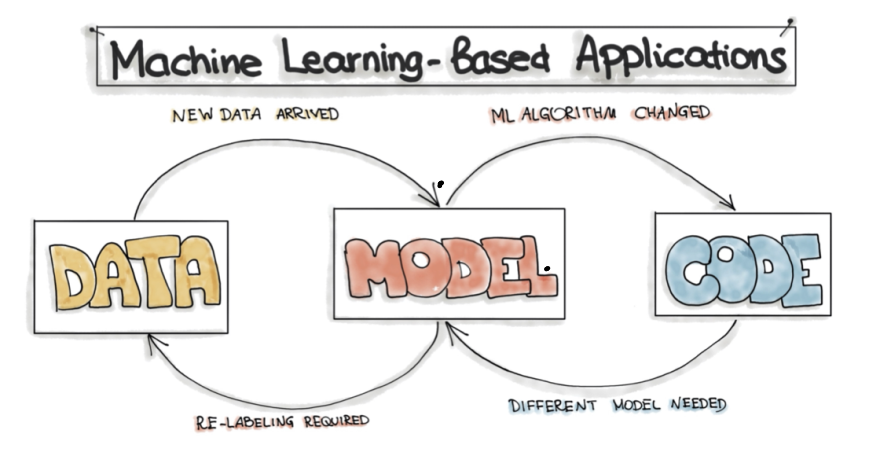

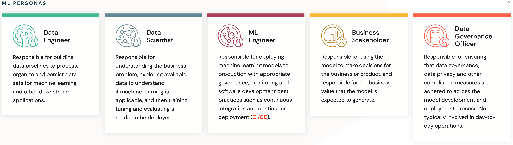

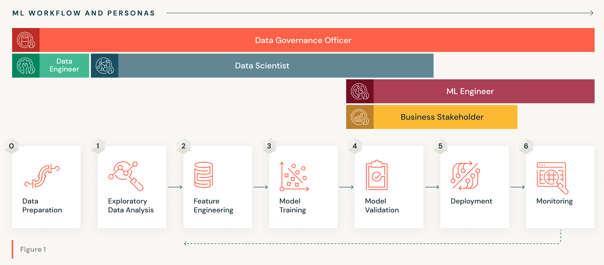

在人工智能项目的开发当中，涉及到多个团队的协同合作，其中因为信息孤岛等原因造成的信息理解偏差，需求无法对其，造作不当和原因不明，是不可避免的挑战。<mark>MLOps 提出了基于项目场景的管理方式，通过将端到端的开发验证，测试迭代等流程全部集中管理起来，一定程度上解决了同一项目中因为开团队协作导致的信息传递不畅带来的问题。</mark>而通过对实验过程的追踪，对数据血缘的记录，数据和算法工程师能够对建模过程中产生的问题进行回溯和追踪，更容易的定位到根源问题所在。

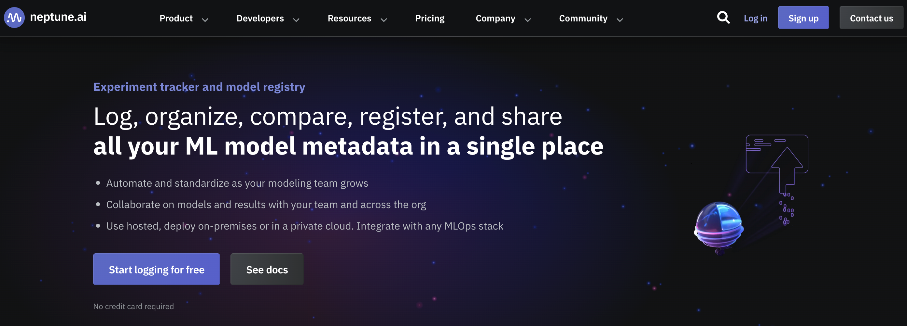

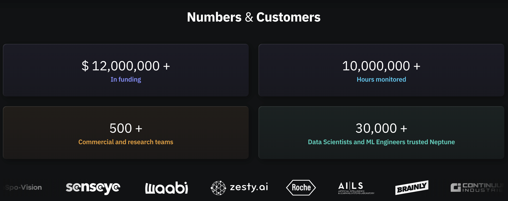

> [**neptune.ai**](https://neptune.ai/)（[Youtube](https://www.youtube.com/@neptune_ai)）是[一家波兰的创业公司欧洲的创业公司](https://www.crunchbase.com/organization/neptune-ml)，其目标是建立实验的追踪系统，可以和 Notebook 进行深度的结合，对整个建模过程中做的操作和实验进行全流程记录，并通过横向和纵向对比以帮开发人员加快模型研发过程。（[UI Demo](https://www.youtube.com/watch?v=uYqT8aHsiQY&list=PLKePQLVx9tOd8TEGdG4PAKz0Owqdv1aaw&index=1)/ [XGBoost Example](https://www.youtube.com/watch?v=zZa350IUbWk&list=PLKePQLVx9tOd8TEGdG4PAKz0Owqdv1aaw&index=9)）

## 环境隔离和资产管理

由于多个团队共同负责一个项目，项目中的每个人各司其职，其中数据工程师，算法工程师，软件工程师，运维工程师各自饰演着不同的角色，需要精细化的权限管理体系，对数据，模型，代码进行权限控制。对于整个研发流程来说，其中涉及到研发实验，测试验证，上线生产三个阶段。三个阶段虽然涉及到的数据，代码和模型非常类似，但其权限要求却大相径庭。 <mark>MLOps 提出通过对环境的隔离，账号的隔离，数据的隔离，代码的隔离来实现精细化的权限控制。</mark>在开发实验环境边界内给与开发者最大限度的自由，并且通过生产环境的精细化权限控制实现对线上服务和资产的保护。

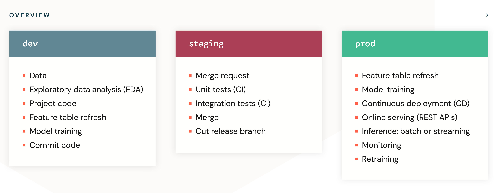

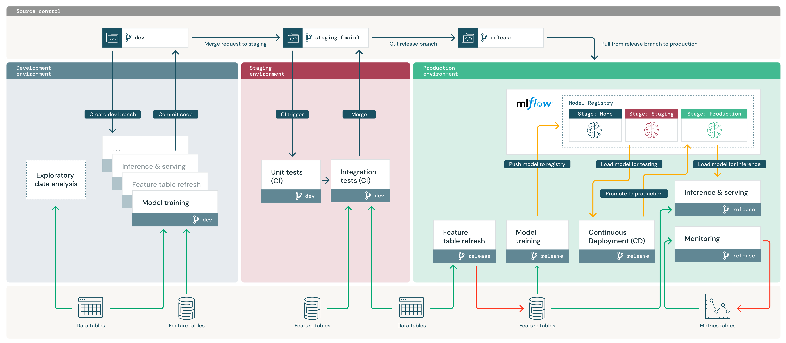

> <mark>databricks</mark> 发布的关于 [mlops 的白皮书](https://www.databricks.com/resources/ebook/the-big-book-of-mlops)中提出了将研发环境分为 dev（开发），staging（测试），prod（生成）三个环境的思路。 不像传统的机器学习流程中通过传递打包好的模型来进行每一步的验收，<mark>databricks 提出把所有的代码当做产物来进行机器学习的交付。</mark>当开发人员在开发环境当中把数据处理，模型算法，软件开发的所有代码都自测验证好之后，直接把代码部署至测试环境中，用测试环境的数据和流程进行模型训练和验证，在测试环境当中完整的重新进行模型训练，封装，验证的全过程。而当测试环境的所有验证都做好之后，再将所有代码部署至正式环境，用正式环境的数据和硬件对模型进行训练和部署。这样做可以有效避免传统部署模型时因为研发环境与正式环境的数据不同而带来的模型效果不理想，但也对整个系统的标准化提出了非常大的要求。

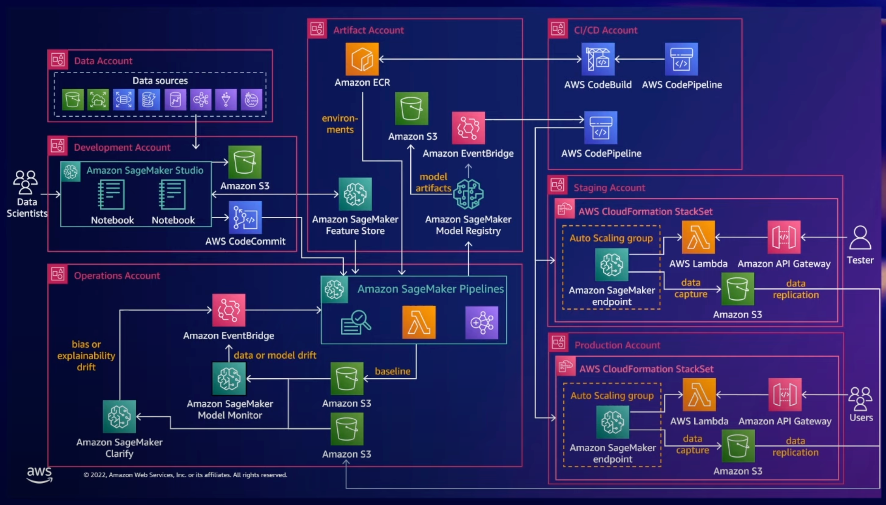

> <mark>AWS</mark> 的架构师[在 2022 新西兰云计算峰会上分享的 MLOps 架构案例](https://www.youtube.com/watch?v=UnAN35gu3Rw)，详细描述了如何利用 AWS 的账号体系和组件，构建一个完整且灵活的 MLOps 架构。 方案中通过分别对比小型，中型，大型公司的使用需求，以 Amazon SageMaker 产品为核心，通过多账号体系管理不同团队，不同步骤，不同业务领域的资产和服务，进行实现流程的有机结合和权限隔离。

## 模型效果与性能监控

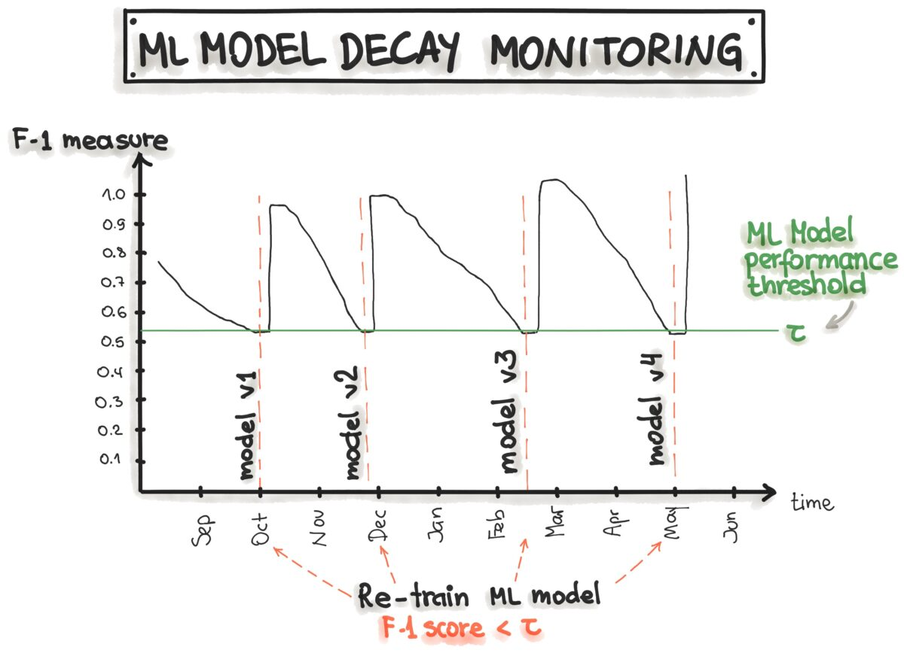

可观测性对于 DevOps 一直都是一个巨大的课题，而 MLOps 更是把这个课题的范围扩大到了模型和数据领域。随着自动化程度越来越高，流水线承担在整个系统中承担的任务也越来越重。一旦某个环节的自动化流程遇到了问题导致数据质量或模型质量不达标，在必然会导致整个系统后续的流程无法高质量的执行。此时对整个系统的质量观测就扮演了非常重要的角色。 <mark>MLOps 将指标的监控和观测作为反馈链路有机地融合进了自动化流程当中。</mark>在模型性能降低到一定的标准的时候会触发模型重训练，用最新的数据来更新模型，以符合最新的线上场景的业务需求。而数据质量和模型质量也是持续观测的目标，如模型的数据依赖发生结构上的变化，持续采集的数据出现了之前没处理到的异常值，模型推理吞吐量激增等问题都需要通过持续的监控来发现和定位。

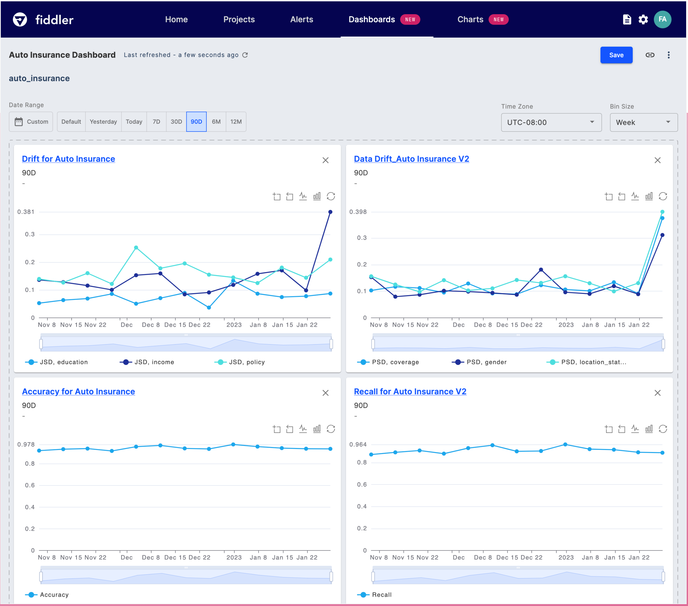

> [**fiddler.ai**](https://www.fiddler.ai/ml-model-monitoring) 作为[硅谷的一家创业公司](https://www.crunchbase.com/organization/fiddler-labs)，提供了丰富的模型监控能力，[了解模型效果下降的根源，并通过全过程的监控增强了模型的可解释性](https://www.youtube.com/watch?v=PENnn3YUAcg)。

> [**neptune.ai**](https://www.youtube.com/watch?v=_lHrVQUZ39Y&list=PLKePQLVx9tOd8TEGdG4PAKz0Owqdv1aaw&index=4) 也提供了丰富的模型相关的监控能力，通过管理海量的元数据来协助团队观测和分析模型。

## 模型安全与合规

模型安全与合规是许多行业和特定地区应用人工智能的最大挑战。尤其是金融，医疗领域和[欧洲](https://www.ncsc.gov.uk/blog-post/introducing-our-new-machine-learning-security-principles)等地区，合规成本巨大且流程繁琐。MLOps 能够提供丰富的工具来降低合规的成本，将合规流程标准化。 <mark>通过自动化流程，MLOps 可以通过自动数据脱敏，数据传输加密等方法保证数据安全。</mark>通过严格跟踪和记录模型的训练和部署历史，确保模型的可解释性和可追溯性，以满足合规要求和业务需求。

> [Tensorleap](https://tensorleap.ai/)是[一家以色列的科技公司](https://www.crunchbase.com/organization/tensorleap)，致力于分析和[提供深度学习模型的可解释性](https://www.youtube.com/@tensorleap6377/videos)，并通过可视化来加快模型迭代和开发进度。

## 可扩展性与灵活性

MLOps 依托于 DevOps，依赖云原生等技术实现模型服务的自动伸缩和拓展。通过集群算力的控制和服务负载的持续监控，系统能够做到在高峰流量来临时自动增加服务节点，提高服务的吞吐量，而在流量低谷通过平滑删除节点来节省算力和机器成本。

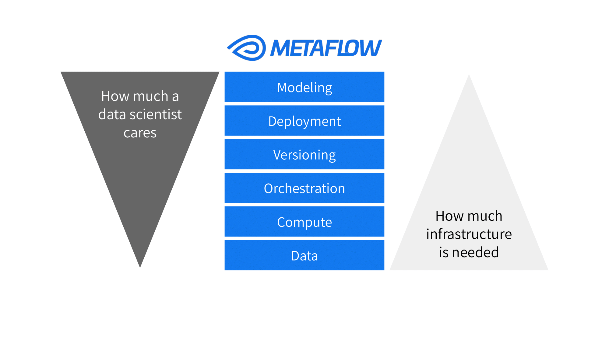

> [MetaFlow](https://docs.metaflow.org/) 是 Netflix 研发并开源的 python lib。它通过[统一的 api 将本地开发和云上部署统一起来](https://docs.metaflow.org/introduction/what-is-metaflow)，使得数据和算法工程师不必关心线上业务的工程部分，专心在数据和算法的开发上。通过底层逻辑和配置将软件架构[自动对接至云上](https://docs.metaflow.org/getting-started/infrastructure)，使得本地可调试的代码可低成本直接部署在云上进行验证和发布。

## 版本控制

MLOps 中通过对数据集，模型文件，训练脚本以及推理代码的版本控制，实现自动部署与回滚。<mark>在高自动化程度的系统中，通过统一的版本管理和调度，服务能够实现低成本，低风险，快速部署和验证。</mark>自动模型重训练和 A/B 测试都强依赖于版本控制来实现极大地研发速度提升。

> [DVC](https://dvc.org/) 是一个由 [iterative.ai](https://www.crunchbase.com/organization/iterative-ai) 维护的开源数据版本管理工具。它使用 dvc 命令生成数据描述文件 `.dvc`，通过 git 命令行像管理代码一样管理数据的变化过程。`.dvc` 文件中记录了数据文件的路径，大小，MD5等描述信息。 这个例子中展示了 `.dvc` 通过 dvc registry 记录[数据的存储位置](https://github.com/iterative/dataset-registry/blob/master/get-started/data.xml.dvc)，并通过 `.dvc` [文件](%28https://github.com/iterative/example-get-started/blob/main/data/data.xml.dvc%29)来关联和描述数据文件。

## 质量验证

基于自动化流水线，MLOps 流程中可以嵌入多种校验工具来保证数据质量和模型效果。

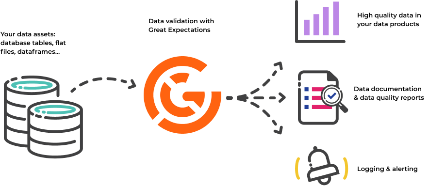

> [Great Expectations](https://greatexpectations.io/) 是一个基于 python 的数据校验工具，通过[简单的配置](https://docs.greatexpectations.io/docs/tutorials/quickstart/) Great Expectations 可以链接数据源和校验脚本，执行高效且快速的数据校验逻辑，以在数据入库前保证数据质量。

# 总结

<mark>MLOps 是一个系统性工程，它不仅体现在将机器学习流程中局部的难点通过工具和流程简化，将复杂的步骤通过统一的抽象来标准化，而且将各个步骤串联起来，形成一个闭环，通过仅仅改变数据本身，快速且高效的将效果呈现至业务中。</mark>

AI 正迎来蓬勃的发展，[越来越多的公司](https://landscape.lfai.foundation/)开始参与到其中，期待通过系统化的建设，MLOps 等工具和方法论能够将改变和进步更快地带入现实。

---

**张育鑫（Taylor Zhang）**

腾讯高级工程师，认证高级云架构工程师，认证高级云开发工程师

机器学习平台，MLOps，大数据，云原生，数据密集型分布式系统

taylorzyx@hotmail.com

[LinkedIn](https://www.linkedin.com/in/yxzh/) | [Blog](https://taylorzyx.hashnode.dev/) | [Github](https://github.com/taylorzhangyx)